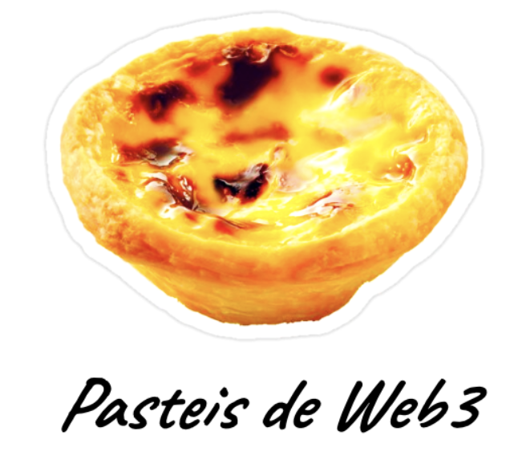
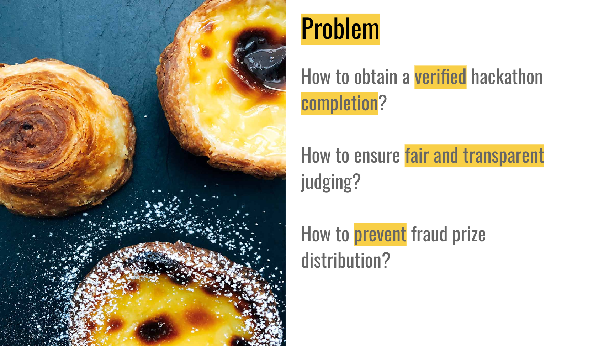
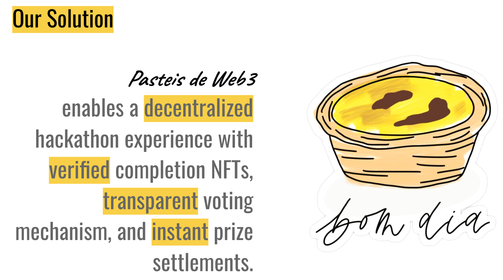
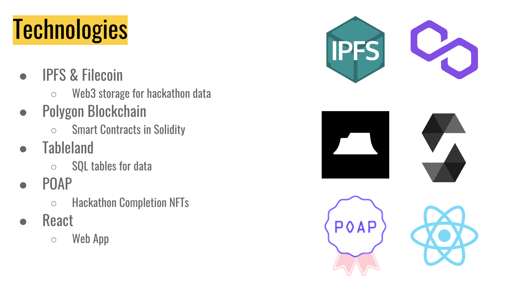
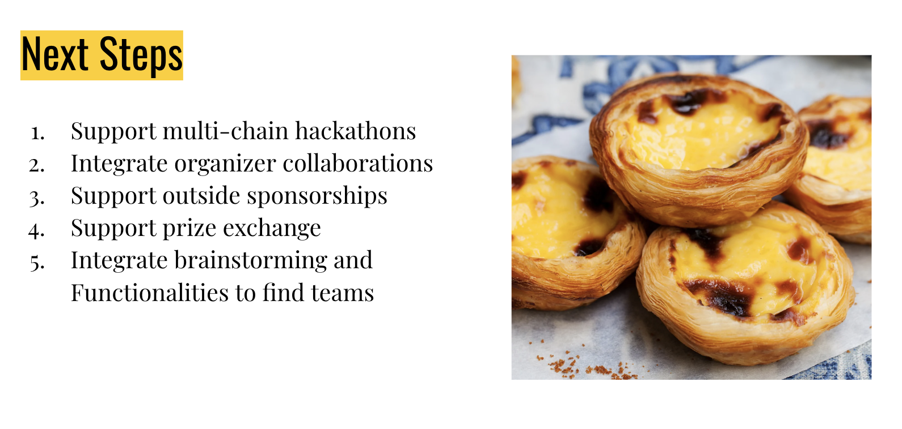

# Pasteis 🍮

Pasteis a decentralized hackathon platform aims to make the hackathon experience more transparent and inclusive by having better features such as prize distribution and team-building. 

YouTube Demo Video: https://youtu.be/zmUg20iNtJU   
EthGlobal Homepage: https://ethglobal.com/showcase/pasteis-de-web3-bza80  

## Our Team

## Our Project

## Product Design

### Hackathon Page

## Next Steps

